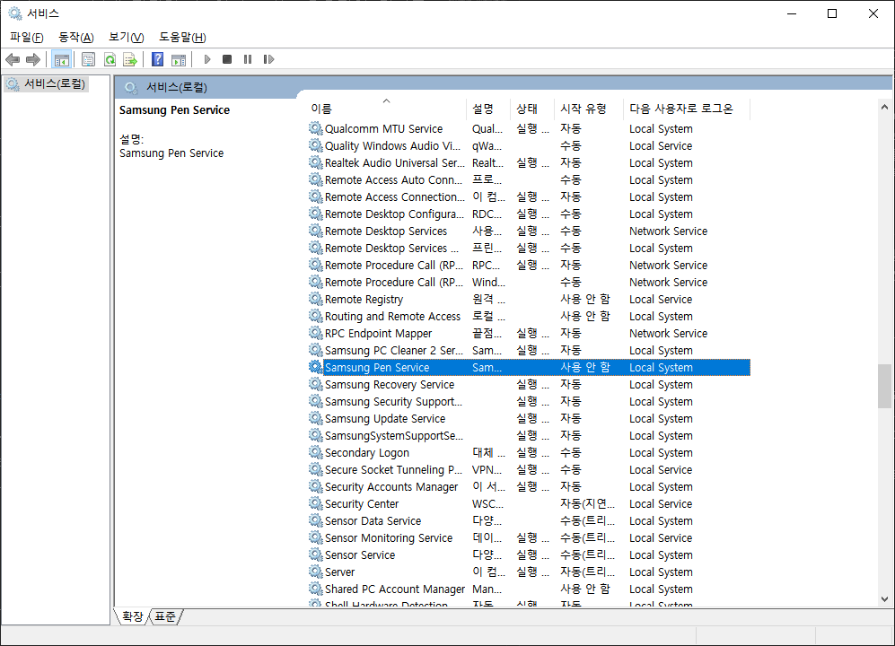
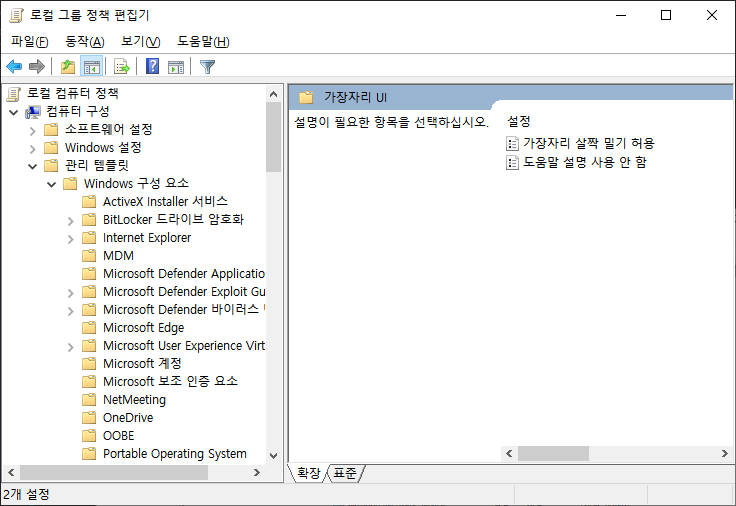

# Galaxy Book Flex Setup

갤럭시 북 플렉스(Galaxy Book Flex) 100% 활용하기 위한 세팅, 일부 내용은 갤럭시 북 플렉스2(Galaxy Book Flex2) 또는 노트북 pen s에서도 적용될 수 있다.

## 개요

필자는 주로 필기 및 간단한 드로잉을 하기 위해 갤럭시 북 플렉스를 구입했고 1년동안 사용했다. 
노트북의 구조 또는 기본 소프트웨어상의 한계점으로 생긴 문제 및 불편한 점이 두루 있다. 
이에 대해 편하게 사용할 수 있는 해결책을 같이 제시한다.

## 구매 전인가?

[갤럭시 북 플렉스 알아야 할 점](./before_purchase.md)

## 1. Air Command 끄기

장시간 필기하다 보면 s펜 버튼을 눌러서 지우고 하는데 air command가 실행되곤 한다. 
이 기능을 끄고 싶으면 서비스 > Samsung Pen Service을 찾아서 사용 안 함 으로 전환한다. 

## 2. Windows Edge Gesture 끄기

Windows Edge Gesture은 윈도우가 태블릿 모드일때 가장자리 스와이프를 통해 특정 커멘드를 실행할 수 있는데 오동작이 많다. 
이 기능을 끄고 싶으면 win + R "gpedit.msc" 입력 뒤 
컴퓨터 구성 > 관리 템플릿 > windows 구성 요소 > 가장자리 UI를 찾아가서 
가장자리 살짝 밀기 허용을 false로 하면 된다.

## 3. Gesture Sign 셋업

윈도우의 부족한 태블릿 모드 제스처를 보충해야 한다. 
windows store에 Gesture Sign을 다운로드 받는다.

## 4. 화면 터치&펜 스크린 끄기

## 5. OneNote + Xodo vs Samsung Note

## 6. 노트북 pen s에서 쓸 수 있는 블루투스 S-Pen 펄 화이트(SPA-MTA1SBW) 플렉스에서도 사용하기

